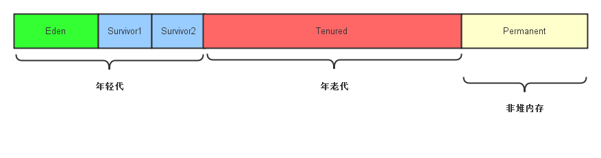
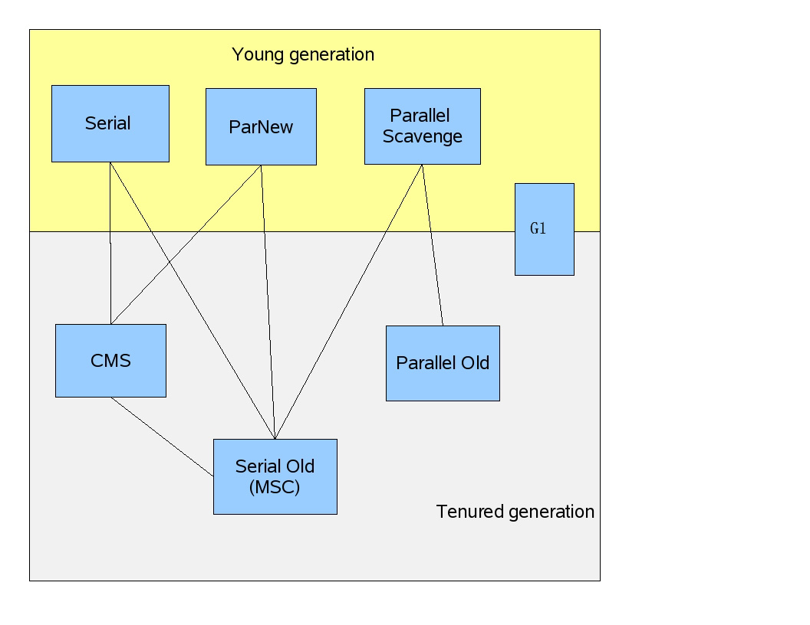

> 这篇是对《深入理解Java虚拟机》的第三章的总结笔记，G1部分还没有细看

## 1 判断对象存活与否
### 1.1 引用计数器(没有GC使用)
* 每当有一个地方引用对象时，数值就+1，引用失效时，数值就-1。
* 问题是无法解决对象之间的循环引用问题，比如对象A的一个字段引用B，对象B的一个字段引用A，然后对象A和B被设置为null，这时无法回收A和B。
### 1.2 可达性分析
* 从一系列GC Roots开始搜索，如果GC Roots到这个对象不可达时，则该对象是不可用的。
* GC Roots包括虚拟机栈中引用的对象，本地方法栈中引用的对象，方法区中类静态属性引用的对象，方法区中常量引用的对象。

<!--more-->

## 2 finalize()
1. 可达性分析后没有与任何GC Roots引用链相连接的对象，会被第一次标记；
2. 这些对象会被筛选是否需要执行finalize()方法：当对象没有覆盖finalize或者finalize已经调用过时，该方法就不会被执行，也就是说finalize最多只会执行一次对于任何一个对象；
3. 对于有必要执行finalize的对象，会被放到一个F-Queue的队列中，由一个虚拟机建立的低优先级线程去执行；
4. 在finalize方法中对象可以和引用链上的任何一个对象建立关联；
5. 之后GC会对F-Queue中的对象进行第二次标记，如果对象重新和引用链中的对象建立关联，则不会被回收。
6. 实践中，不要使用这个方法，因为不确定性的大，运行代价高。

## 3 永久代垃圾收集
* 废弃常量：没有任何String对象引用常量池中的某个常量，则它会被清理出常量池
* 无用的类：该类所有实例都被回收，并且；加载该类的ClassLoader已被回收，并且；该类对应的java.lang.Class对象没有在任何地方被引用，无法通过反射访问该类的方法。

## 4 GC算法
### 4.1 标记-清除算法
* 用来回收老年代。首先标记出所有需要回收的对象，然后统一回收所有被标记的对象。
* 问题：两个阶段效率都不高，产生大量不连续的内存片段。

### 4.2 复制算法
* 用来回收年轻代内存。将年轻代划分为一块较大的Eden区，和两块较小的Suvivor区域。每次使用Eden和一块suvivor。当回收发生时，这两块区域的存货对象被全部复制到另一块suvivor区域，然后清理掉他们的空间。

### 4.3 标记-整理
* 用来回收老年代内存。和标记-清除一开始一样，但它把所有被标记的存活对象移动到内存的一段，然后清理掉剩下的内存。

### 4.4 分代收集
* 根据年轻代和年老代的特点。年轻代每次回收都有大量对象死去，就使用复制算法；而老年代就使用标记-清理或标记-整理算法。

## 5 内存分配和回收策略
* 对象一般先在eden中分配，如果启用了TLAB，则先在TLAB上分配，如果空间不够，虚拟机将发起一次Minor GC。
* 需要大量连续空间的对象，比如数组或者很长的字符串。虚拟机有一个-XX: PretenureSizeThreshold参数，大于该值的对象直接进入老年代分配。
* 对象在Eden被分配内存，经历第一次Minor GC后仍旧存货，并被幸存者空间容纳，对象年龄就设置为1，之后没经历过一次Minor GC年龄就+1，默认在年龄超过15时就进入老年代。这个值可以在-XX:MaxTenuringthreshold中设置。
* 如果在幸存者空间中相同年龄所有对象大小的综合大于幸存者空间的一半，年龄大于或等于该年龄的对象就可以直接进入老年代。
* 空间分配担保：
  * 在进行Minor GC前，虚拟机先检查老年代可用的连续空间是否大于新生代所有对象总空间，如果大于，则此次回收是安全的（因为即使所有对象都要进入老年代，也有足够的空间）；
  * 如果不是，则检查HandlePromotionFailure设置是否允许失败担保，如果允许，再检查老年代最大可用的连续空间是否大于历次进入老年代对象的平均大小，如果大于，则进行一次Minor GC，尽管可能是有风险的；如果小于，或者不允许失败担保，则进行一次Full GC。

## 6 垃圾收集器

### 6.1 Serial收集器
* 单线程，它进行垃圾收集的时候，必须暂停其他所有工作线程，直到它结束
* 虚拟机运行Client模式下默认的新生代收集器，采用复制算法；
* 优点：简单高效，单线程收集没有线程交互的开销
### 6.2 ParNew 收集器
* Serial的多线程版本（并行收集器：多个垃圾收集线程一起工作，但是用户线程仍旧暂停），但是单CPU环境下不会比Serial有更好的效果，随着CPU数量的增加，能增加GC时对系统资源的有效利用；；
* 虚拟机Server模式下的新生代首选收集器，仍旧采取复制算法，
### 6.3 Parallel Scavenge 收集器
* 同ParNew是一个并行收集器，采用复制算法；
* 目标是达到一个可控制的吞吐量（吞吐量 = 运行用户代码的时间 / (运行用户代码的时间 + 垃圾收集时间)），适合在后天运算不需要太多交互的任务。
* 两个参数用于控制吞吐量：最大垃圾收集停顿时间-XX:MaxGCPauseMills；吞吐量大小-XX:GCTimeRatio;
* 缩短最大停顿时间，是以牺牲吞吐量和缩小新生代空间来换取的，比如收集一个较小的新生代总比较大的新生代的时间要短；
* 这个收集器还有自适应调整新生代大小，eden和suvivor比例，老年代晋升年龄的机制。
### 6.4 Serial Old 收集器
* Serial的老年代版本，单线程，标记-整理算法；
* 主要给Client模式下的虚拟机使用，在Server模式下与Parallel Scavenge配合使用，或者作为CMS的后备方案。
### 6.5 Parallel Old 收集器
* Parallel Scavenge 的老年代版本，标记-整理算法；
* 同样是注重吞吐量和CPU资源。
### 6.6 CMS - Concurrent Mark Sweep
* 并发收集器（用户线程和垃圾收集线程交替执行，之前多线程的都是并行），目的在于缩短停顿时间，标记-清除算法；
* 初始标记(initial mark): 仅标记GC Root能直接关联到的对象，速度很快，但是单线程工作，并且用户线程暂定；
* 并发标记(concurrent mark): 进行GC Root Tracing，GC线程和用户线程同时运作；
* 重新标记(remark):修正并发标记期间，用户线程行为导致标记产生变动的那一部分对象的标记记录；多线程重现标记，但是用户线程暂定；
* 并发清除(concurrent sweep):清除，和用户线程同时运作；
* 其中并发标记和并发清除需时最长，但是可以和用户线程同时工作；因此CMS的特点是并发收集，低停顿；
* 缺点1：并发阶段需要占用CPU时间，而导致程序运行减慢，总吞吐量降低；
* 缺点2：因为采用标记-清除而不是标记-整理算法，所以会产生大量零散空间，当没有足够的连续空间来分配大对象是，必须触发Full GC；
* 缺点3：垃圾收集阶段用户线程的运行带来的问题：1. 不能等老年代全部满时再进行收集，因为要预料一部分空间提供并发收集时程序的运作，而当此预留内存无法满足程序需要时，就会发生Concurrent Mode Failure，这是将启用后备的Serial Old收集器来处理老年代，导致停顿时间很长；2. 并发清理阶段程序还在运行，就会产生新的垃圾，这部分垃圾出现在标记过程之后，需要等待下一次GC。
### 6.7 Garbage First (G1)
* 整个Java堆被划分成了多个大小相等Region，新生代和老年代不再是连续的，每个region可以属于新生代也可以属于老年代；
* G1收集器可以建立可以预测的停顿模型，因为它有计划地避免在整个Java堆中进行全区域的垃圾收集，它跟踪各个Region里面的垃圾堆的价值大小，维护一个优先列表，每次根据允许的时间，优先回收价值最大的Region，这也是名称的由来。

